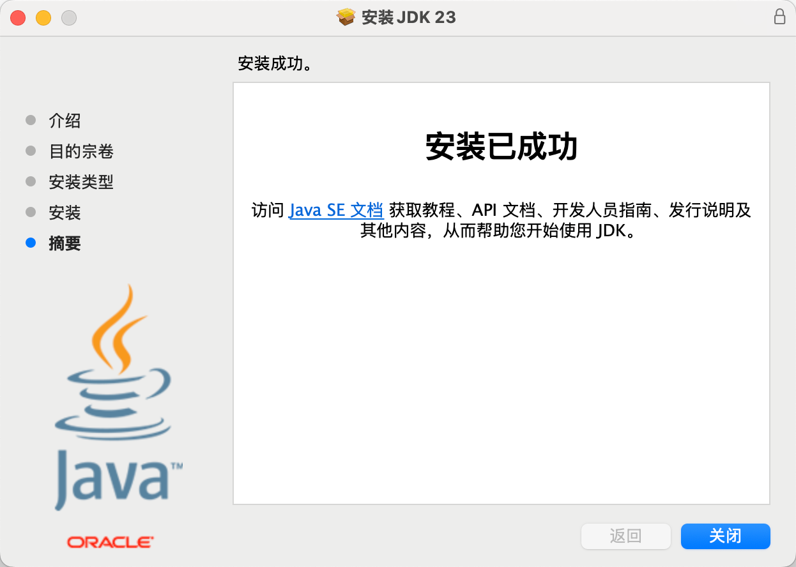
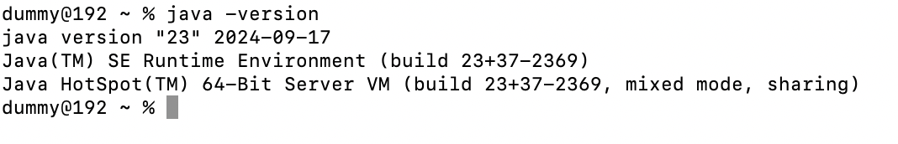
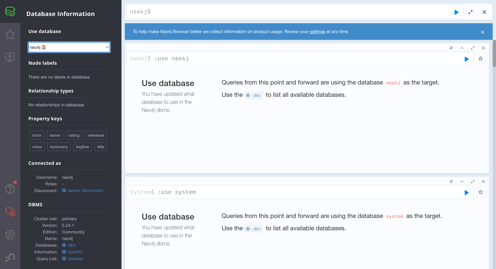

# Graph RAG

## 知识图谱

### 图谱知识融合

业务很重要，涉及到结构设计
## 应用
- 知识图谱在搜索引擎中的应用
  - 先找实体，在寻找实体关系
- 知识图谱在医疗领域应用实例
  - 智能问答系统
  - 在医疗中进行辅助决策
- 金融与推荐领域的应用
  - 反欺诈，风控模型是知识图谱在金融领域的经典应用
  - 推荐系统，通过一个内容，查找其中的实体，利用实体关系进行推荐(互联网数据互通)
- 数据获取分析
  - 数据格式以及来源五花八门
  - 实体统一；指代消解   

## 知识图谱数据库 NEO4J

- 数据库选型：用户量多 模版好找 报错能查 上手容易 上业务不建议用最新的 neo4j 与 python交互容易

demo 参考：https://grapheco.org/InteractiveGraph/dist/examples/example1.html

### neo4j的安装与设置
- java jdk的安装
https://www.oracle.com/hk/java/technologies/downloads/#jdk23-mac
m2芯片属于arm架构，需要下载arm的jdk
  
- 检查安装情况`java -version`

- neo4j的安装
https://neo4j.com/deployment-center/
选择社区版 
下载好后配置自己的环境变量启动服务使用借口访问webui
http://localhost:7474

### Neo4j增删改查
增：增加一个节点
create (n:Person {name:"Alice"})
带有关系属性
create (a:Person {name:"Alice"})-[r:KNOWS {since:1999}]->(b:Person {name:"Bob"})
删：
create (n:Person {name:"Alice"})
match (n:Person{name:"Alice"}) delete n
删除关系
match(p:Person(p:Person{name:"Alice"})-[r:KNOWS]->(b)) delete r
改：
加上标签
match（t:Person）where id(t)=1 set t:Movie return t
加上属性
mathch(t:Person) where id(t)=1 set t={name:"Alice",age:30} return t
修改属性
match(t:Person) where id(t)=1 set t.age=20 return t
查：
match(n:Person) return n

不建议死记硬背 现用现查呗

# 基于知识图谱的医药问答系统

## 数据集介绍

要利用llm生成cql语句，需要一个数据集，数据集需要包含实体与关系，实体与关系之间需要有语义关系，实体与关系之间需要有

数据集下载 

https://www.kaggle.com/datasets/tmdb/tmdb-movie-metadata

https://www.kaggle.com/datasets/netflix-inc/netflix-prize-data